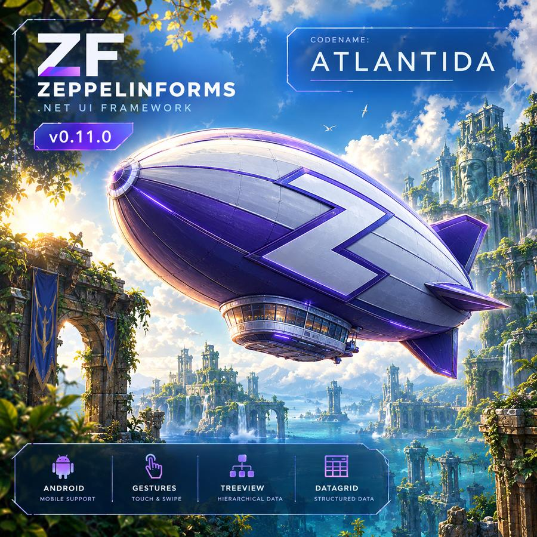
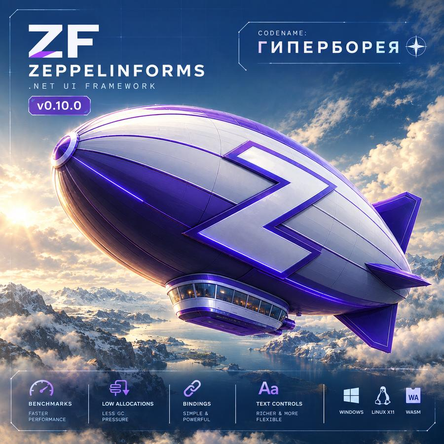
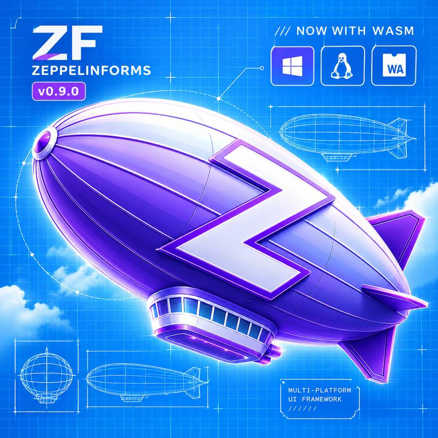

# Changes

## [0.12.0] - El Dorado

## [0.11.0] - Atlantida

### Breaking changes

- `DisplayInfo.Dpi` is required. `Scale` is a UI scaling decision — X11 rounds it
  to quarters, Android counts it from a 160 dpi base — so physical density cannot
  be recovered from it, and gesture thresholds need the real value. Every
  `IDisplayProvider` implementation must now supply it
- The input pipeline is built on pointer contacts rather than on the mouse.
  `Form.OnPointerDown`, `OnPointerMove` and `OnPointerUp` take `PointerEventArgs`;
  the old positional signatures remain as thin adapters, so platform backends
  needed no changes
- `PointerContact` is public: gesture recognizers are a public extension point
  and need the contact's history
- `Image.LoadAsset` resolves paths through the new `Assets.Root` instead of
  hardcoding `AppContext.BaseDirectory`. The default is the old path, so desktop
  behaviour is unchanged; Android points it at the application data directory
- A reentrant `Invalidate` from `MeasureOverride` or `ArrangeOverride` no longer
  fails a contract. Virtualizing panels create containers during measurement by
  necessity, so the request is deferred and satisfied by an extra layout pass.
  The contract still fires when layout fails to converge in four passes
- `Calendar` takes month names, weekday captions and the first day of the week
  from the culture. Previously the week always started on Monday and the captions
  were hardcoded Russian
- `VirtualizingStackPanel.Refresh` no longer clears its children eagerly; it
  marks the realized range stale and lets the next layout pass rebuild it

### Android

- `ZeppelinForms.Android`: a backend on `net10.0-android`. Windows are layers on
  a single surface, as in the browser; frames come from `Choreographer`
- Real multi-touch. `MotionEvent` is decomposed per contact, including the
  pointers that `ACTION_MOVE` carries alongside the one that moved
- `AndroidDisplayProvider` reports both the 160-based density as `Scale` and the
  panel's real dpi as `Dpi`
- Safe area handling: system bars, display cutout and the on-screen keyboard
  arrive as separate insets, and the root form lays out inside them. This is not
  optional — Android 15 forces edge-to-edge for `targetSdk` 35
- On-screen keyboard through the new `ISoftKeyboard`, a separate interface rather
  than methods on `IPlatformWindow`: four desktop backends would have had nothing
  to put in them but empty bodies. It follows focus — a control that accepts text
  input raises the keyboard, anything else hides it
- Text from the IME arrives through an `InputConnection`, so suggestions,
  autocorrect and emoji work, not only key events
- Android key codes are mapped to `Key`; the printable character arrives
  separately from the key, as `WM_CHAR` does on Windows
- The system back gesture is surfaced as `AndroidPlatform.BackRequested` rather
  than mapped onto `Escape`: `Form.OnKeyDown` returns nothing, so "a dialog
  closed" could not be told apart from "nobody handled it"
- Mouse wheel and hover from an attached mouse
- `AndroidApp.Run` unpacks APK assets into the application directory before the
  platform starts

### Input and gestures

- Contacts are tracked per pointer id: hover exists only for a mouse, platform
  capture is reference-counted because `IPlatformWindow.CaptureMouse` is
  window-wide, and the hit chain is captured at press time rather than recomputed
- `PointerCanceled` is a first-class event. Previously a lost capture was
  simulated with a fake mouse-up, which a `TrackBar` or a `GridSplitter` took for
  a real release and committed a value on
- `GestureArena` arbitrates one contact between recognizers attached to elements.
  Recognition is an element's policy; arbitration is global, because a contact has
  exactly one winner. A winner cancels the interaction the elements under it had
  already started
- Recognizers: tap, pan, long press, swipe, pinch and rotate. Pinch and rotate
  span two contacts and win in every arena they take part in at once
- `PointerThresholds` states its thresholds in millimetres. A slop tuned in
  pixels on a desktop mouse is either indistinguishable from zero or
  insurmountable on a phone
- `PageControl` navigates on a swipe, by history or by page order
- The browser backend now forwards `pointerId`, `pointerType`, `pressure` and
  `pointercancel`, and sets `touch-action: none` — without it the browser keeps
  panning for itself

### TreeView

- Expanded nodes are projected into a flat list which feeds
  `VirtualizingStackPanel`. Nested containers would have been simpler and would
  have killed virtualization: the visible range is computed by dividing scroll by
  row height, and that needs a one-dimensional sequence
- A node's change notification is raised at the root, so `TreeView` subscribes to
  one node instead of every node — there is nothing to forget to unsubscribe
- One control per row, not per cell; the expander glyph is shared with `Spoiler`
  through `Glyphs.DrawChevron`

### DataGridView

- Cells are drawn rather than built from controls: twenty columns over thirty
  visible rows would mean six hundred elements measured and arranged every frame
- Columns reach their value through a delegate rather than reflection or a
  binding. Reflection per cell per frame is the cost 0.10.0 spent effort
  removing, and a binding would mean one subscription per visible cell,
  recreated on every scroll
- Row virtualization, a header that scrolls horizontally with the body but not
  vertically, star and fixed column widths, row selection, `ScrollIntoView`
- `Auto` width measures the header and the visible rows, not the whole data set:
  scanning everything on each layout pass would defeat virtualization. Column
  width can therefore change while scrolling — use a fixed width when that matters

### Adaptive layout

- `SizeClass` and `Breakpoints` classify a layout region, not the screen: a
  300-unit panel inside a wide window is as cramped as a whole phone screen
- `LayoutBuilder.RebuildKey` makes a rebuild depend on meaning rather than on
  pixels. The size threshold fires almost every frame while a window frame is
  dragged, and a rebuild replaces the child along with its focus, scroll position
  and typed text
- `AdaptiveLayout` rebuilds only when the size class changes

### Fixes

- `Graphics.DrawText` clips to the rectangle it is given. The rectangle was used
  only for alignment, so a caption too wide for its box was drawn over its
  neighbours
- `PanelControl` no longer requests a layout pass for children added during
  measurement, which cost a full pass per list scroll
- `VirtualizingStackPanel` stopped accumulating containers it can never reuse:
  with an item template the recycle pool is useless, and pushing into it leaked
  until the window closed
- An animation on a hidden subtree is no longer advanced or repainted.
  `PageControl` hides pages without detaching them, so `IsVisible` alone was not
  enough — `UIElement.IsEffectivelyVisible` walks the ancestors
- `Calendar` scales its font and captions to the available size, shares one
  geometry between drawing and hit testing, no longer paints the hover highlight
  over the navigation arrows, and no longer fills a selected cell twice
- `TreeView` and `DataGridView` override the `Center` alignment that
  `UnitControl` gives its descendants. A centred list row swallows the depth
  indent and reads as if nesting were inverted
- `Point.DistanceBetweenM` computed a Manhattan distance through two square roots
  instead of `MathF.Abs`

### Known limitations

- Content cannot be scrolled by dragging it. `PanelControl` scrolls with the
  wheel and programmatically, and scrollbar thumbs cannot be dragged, so on
  Android no list can be scrolled at all. This is the first thing 0.12.0 will fix
- `DataGridView` has no cell editing, no sorting, no column resizing and no
  frozen columns. `CanSort` and `Comparer` exist on the column but are not used yet
- `TreeView` has no keyboard navigation
- Desktop backends deliver a single contact: pinch and rotate need Android or a
  touchscreen in a browser. `WM_POINTER` and XInput2 are not wired up
- Android has no clipboard, no file dialogs and no `IAppLifecycle`, so frames
  keep running while the application is in the background
- `Form.ShowDialog` throws on Android — only `ShowDialogAsync` works, because a
  nested loop cannot block the UI thread there
- A repaint flicker in `TreeView` on Android is unresolved

## [0.10.0] - Hyperborea

### Breaking changes

- New analyzer rules: ZF0006 (a styled property assigned from a constructor)
  and ZF0007 (an external styled property declared `partial`)
- Warnings are now errors across the solution
- `TextBox.Text` is a styled property. It can be bound and it appears in
  `PropertyGrid`; assigning it now invalidates layout rather than only repainting
- `[Styled]` gained `External`: the value lives in another object, the generator
  emits only the registration, and the control writes its own accessors plus a
  `Write<Name>` method the registration calls

### Data bindings

- `UIElement.Bind`, `Unbind` and `UnbindAll` connect a styled property to a
  property of any source object. `OneWay` and `TwoWay` are supported; a source
  implementing `INotifyPropertyChanged` pushes its changes to the target
- A binding holds its target weakly: a live model no longer keeps a closed
  window alive, and a binding whose element is gone unsubscribes itself
- Bindings sit between the theme and user code in the value precedence. The
  theme does not override a bound value; an assignment from user code does, and
  breaks a `OneWay` binding rather than letting the next source change silently
  overwrite what the user wrote
- `ClearValue` removes the binding along with the value

### Performance

- Fixed an image memory leak. `SkiaGraphics` pinned the pixel buffer of every
  decoded image with a `GCHandle` that was never released: `ConditionalWeakTable`
  does not dispose its values, so the handle outlived the image and rooted the
  array for the lifetime of the process. Images are now uploaded with
  `SKImage.FromPixelCopy` and released together with their cache entry. This also
  fixes unbounded growth in `MapControl`, whose LRU evicted tiles that stayed pinned.
- Added a text cache keyed by string and font. One entry holds the split into
  font runs, the run advances, the line metrics and the `SKTextBlob` for each run.
  Measuring a string no longer walks it rune by rune, and drawing no longer
  rebuilds the glyph run on every frame.
- `SkiaGraphics` reuses pooled `SKPaint` instances for fills and strokes instead
  of allocating one per primitive.
- `Label` caches its split into lines instead of recomputing it on every measure
  and every draw.
- Replaced deprecated `SKPath` mutation and `SKTypeface.ContainsGlyph` with
  `SKPathBuilder` and `SKFont`.
- Fixed an unbounded font fallback cache. Its key includes the code point, so
  walking emoji or CJK added an entry per character and never released one.
  All font caches are now generational with a fixed ceiling: entries the
  application keeps using survive a rotation, one-off entries do not.
- `SKFont` caches are per-thread. `SKFont` mutates internal state while
  measuring, so sharing one across parallel snapshot tests was a race that no
  dictionary lock could fix.
- `Theme.Apply` caches the applier chain per type instead of allocating a stack
  and walking the base-type chain for every element.
- `SkiaGraphics.NoiseShader` was an expression-bodied property and rebuilt the
  shader on every call, contrary to what its own comment claimed.

Measured on a 1280x800 offscreen surface, Windows, workstation GC:

| Scenario | Before | After |
| -------- | ------ | ----- |
| 300-label form, one frame | 26.2 ms, 7.06 MB allocated | 2.9 ms, 9.4 KB |
| Business form, one frame | 3.2 ms, 398 KB allocated | 0.9 ms, 3.4 KB |
| 1000 repeated text measurements | 33.8 ms, 11.5 MB allocated | 0.06 ms, 8 B |
| Full layout pass | 0.55 ms, 112 KB allocated | 0.13 ms, 15.9 KB |

### Text

- Font runs are split by grapheme cluster instead of by rune. A composite emoji —
  a ZWJ sequence, a flag, a skin-tone modifier — is several runes whose parts
  resolve to different typefaces, and the per-rune walk tore such a sequence
  apart into separate glyphs
- With `Font.FilePath` set, weight and style are now synthesised. A font file
  carries one face and `SKTypeface.FromFile` cannot pick another, so bold text
  used to render regular. This closes a known limitation from 0.9.0

### Fixes

- The theme was never applied to overlays. Flyouts, toasts, tooltips, context
  menus and the inspector went into the overlay list directly, bypassing
  `AttachTree` — so they kept default colors, stayed unregistered in `NameScope`
  and never got `OnAttached`. Closing an overlay likewise skipped `DetachTree`,
  leaving it in `NameScope` with its animations still running and input
  dispatchers still referencing it. Overlays now have a single entry and exit
  point, and a theme change reaches them too
- Animations added before the window existed did not start the frame timer:
  `Frames.Start` was called on a null platform window and the animation sat in
  the list forever
- `PropertyGrid` had no scrolling, so properties past the bottom edge were
  unreachable
- `DetachTree` cleared `InspectedElement` and the tooltip owner unconditionally,
  regardless of which subtree was detaching

### Effects

- Add `GlitchEffect`: channel separation and horizontal slice displacement,
  animated in discrete steps
- `Graphics` gained layer capture — `BeginCapture`, `EndCapture`, `DrawCapture`.
  An effect can redirect an element into an offscreen layer and then draw the
  result as many times as it needs, with per-channel filtering and blending.
  This is the base any effect built on repeated drawing needs

### Developer experience

- `UIElement.With` configures an element in place without breaking an
  expression, so a whole view can be written as one tree
- `At(row, column)` places an element in a `Grid` from an expression
- ZF0006 reports a styled property assigned from a control constructor: such an
  assignment marks the value as user-set and locks the theme out permanently.
  Use `SetControlDefault` instead
- ZF0007 reports an external styled property left `partial`
- `ZfContract` checks internal invariants in debug builds and throws instead of
  failing quietly. Checks are compiled out of release builds entirely
- `SkiaDiagnostics` exposes cache and pool counters. Retained-memory figures
  cannot tell a bounded cache at its working size from an actual leak; an entry
  count can
- `Assets.Logo` and `Icon.ToImage` make the embedded icon usable as an image.
  Images inside an ICO are stored as DIB — a BMP without its file header — which
  no decoder opens on its own

### Examples

- The example project is shared between the Windows and Linux hosts
- All user-visible text is in English

## [0.9.0] - Antarctica

### Breaking changes
- Platform rework
	- `IPlatformWindow` is now the minimum every platform can implement. Desktop-only members — title, opacity, window state, bounds — moved to the new `IDesktopWindow`, which the browser does not implement
	- `IPlatform.Run` renamed to `Start`: where the host owns the loop, it returns immediately
	- `INestedLoopSupport` split off from `IFrameDriver`. Platforms without a nested event loop do not implement it, and `Form.ShowDialog` throws there
	- `IPlatform` moved from the global namespace into `ZeppelinForms`
	- `ITextMeasurer` gained `IsReady` and `PrepareAsync` for platforms that load fonts asynchronously
	- `SkiaRenderer.Render` takes `clearBackground` and `origin` so several forms can share one surface
- Transition to async dialog model
- Package versions are now managed centrally in `Directory.Packages.props`
- Dropped the unused `SkiaSharp.HarfBuzz` dependency

### WebAssembly
- New `ZeppelinForms.Browser` backend targeting `net10.0-browser`
	- Skia renders into a buffer that is copied to a `<canvas>` with `putImageData`
	- Frames come from `requestAnimationFrame`; repaints are coalesced into one per frame
	- Input through Pointer and Keyboard Events, with `KeyboardEvent.code` mapped to `Key`
	- Page lifecycle — `visibilitychange` and `pagehide` — surfaced through `IAppLifecycle`
	- Clipboard, cursors, document title and tab icon
- `BrowserApp.RunAsync` starts an application in one call: asset preload, platform, font, `App.Run`
- Several forms share one canvas: dialogs stack on top of the main form over a dimmed background
- `BrowserFilePicker` implements file selection with `<input type=file>`; picked files land in `/uploads` of the virtual file system

### Fixes
- Fix `PageControl` page transition
- `Form.Closed` and `Form.OnWindowClosed` give dialogs a single completion point, whichever way the window was closed. `ShowDialogAsync` previously never returned
- `ZfSynchronizationContext` returns `await` continuations to the UI thread
- Changing the theme no longer strips `FilePath` from `Font.Default`
- Removed a dead `_disposed` field in `TextInputControl` and two unused fields in `Win32Window`
- `WrapPanel.Position` and `DragList.Drop` renamed to `ToPoint` and `CompleteDrop`: both hid members of `UIElement`
- `X11Window.SetDragDropEnabled(false)` no longer dereferences a null drop target

### Features
- Drag&Drop improvements
	- Add platform specific Drag&Drop support for Windows and Linux
	- `UIElement` have `DragEnter`, `DragOver`, `Drag` events
	- `UIElement` have `AllowDrop` property
- Add Linux opacity window support
- Input improvements
	- Add `Keyboard` class
	- Add all key codes to enum 
	- Add more mouse events
- Add `IAnimation.Cancel(bool)`
- Async dialogs: `MessageBox.ShowAsync`, `ConfirmAsync`, `ErrorAsync`; `InputBox.ShowAsync`, `ShowNumberAsync`; `FileDialog.OpenFileAsync`, `OpenFilesAsync`, `SaveFileAsync`, `SelectFolderAsync`
- `IFilePicker` lets a platform replace the managed file browser with a system picker
- `Form.OpenForms` lists forms that currently have a window

### Controls
- Add `AttachButton`

### Known limitations in the browser
- Synchronous `Form.ShowDialog`, `MessageBox.Show` and friends throw `NotSupportedException`. Blocking the thread while still receiving events is impossible in a browser — use the `*Async` variants
- System drag and drop is not supported
- Folder selection is not supported: the concept does not exist in a browser
- Repaints are always full-surface

## [0.8.0]

### Breaking changes
- StyledProperties
- Removed `ScrollViewer`
- Continue migration controls bases
	- `DecoratedPanel`: `SplitContainer`, `PropertyGrid`, `PageControl`
	- `DecoratedWrapControl`: `LayoutBuilder`, `Page`
	- `UnitControl`: `Calendar`, `MenuBar`, `MenuList`, `ScrollBar`, `HintLabel`, `PageIndicator`, `GridSplitter`
	- `InteractiveControl`: `TrackBar`, `ToggleSwitch`
- Remove `FocusableControl`
- Remove `ShowVerticalBar` and `ShowHorizontalBar` in `PanelControl`
- `RippleEffect` renamed to `RippleAnimation`

### Fixes
- `CheckBox`|`RadioButton`: `HorizontalContentAlign` and `VerticalContentAlign` don't throw `NotImplementedException` 
- Remove duplicate content align properties in `Button`, `CheckBox`, `RadioButton`, `ToggleSwitch`, `Label`
- `UIElement` properties `Parent` and `Owner` optimized with cache value
- Now `Form` with animations invalidate only animations targets  
- Fix `Form` animation in `DetachTree`
- Fix: `Form.Tick` behavior with animation by index
- Fix `PageControl` can showing ghost pages over current page
- Fix mouse capture
- Fix `GradientBorder` filled all background by default
- Fix `SplitButton` width changed when value selected
- CI: Add flag  `--output Detailed`

### Features
- Add managed file dialogs
- Add `Image.LoadFromUriAsync`
- Add `LoopAnimation` class
- Add animation extensions `AnimateLoop` and `StopAnimation` 
- Add `PanelControl.ScrollBarMode`
- Add gradient background support
- `SplitButton` change button text when value selected
- Add multiselect for `ListBox`

### New controls
- Add `Loader`
- Add `WrapPanel`
- Add `Table`
- Add `AttachButton`

### Examples
- Now `MapControl` moved to single page
- Add `Loader` page
- Add `DragList` page

## [0.7.0]

### Breaking changes
- Extract more base controls:
	- `DecoratedControl`
	- `DecoratedPanel`
	- `DecoratedWrapPanel`
	- `FocusableControl`
	- `InteractiveControl`
	- `TextInputControl`
- `ScrollViewer` marked as obsolete
- Tests: Add `DrawSmokeTests`

### Features
- Add **ENG** part og `README.md`
- Add Drag&Drop control support
- Add effects for any `UIElement`
- Add `Ripple` animation for buttons
- Add `GradientStop` primitive
- Add `Form.CaptureMouse`
- Add `Form.AddOverlay` 
- Add `PictureBox.SetImage`
- Add `Color.Lerp(Color,Color,float)`
- Add new colors in `Colors` class
- Add `MediaColors` class
- Add constructor with single `UIElement` for `WrapPanel`
- `StackPanel` now can align children
	- Add `MainAxisAlignment`
	- Add `CrossAxisAlignment`
- Now `Grid` correct work with `RowSpan` and `ColumnSpan`
- Add extension method `Add(UIElement,int,int)` for `ObservableCollection<UIElement>` with `Row` and `Column` assign
- Add `GradientStop` primitive
- Lazy initialization for `MapControl`
- Windows: Disabled VSync in GPU render 

### Fixes
- Fix bounds in painting, effects etc
- Fix more theme style applies 
- Fix version in `Directory.Build.props`
- CI: `Node.JS` version increased 
- CI: Snapshot creating otherwise 

### New controls
- Add `PageControl` 
- Add `Page`
- Add `PageIndicator`
- Add `GradientBorder`
- Add `GripBox`
- Add `DragList`

### Examples
- Now using `PageControl` for view switching
- Now contains button with **GitHub** link
- Add **Calc** example
- Add **Effects** example

## [0.6.0] — 2026-09-03

### Breaking changes
- Old class LightThemeColors removed

### Features
- Add Display API
- Add OnPreviewMouseDown
- Right\Middle mouse button events
- Mouse events without location	now has location
- Now disabled control have special filling
- Add FlexGrow support for StackPanel
- Add RowSpan and ColumnSpan for UniformGrid

### New controls
- Add MapControl
- Add GroupBox

### Fixes
- Fix all flyout controls. Now all flyouts will be closed correct
- Fix click in clickable UIElement in ListBox dont raise selection
- Fix pressed buttons blink
- Fix ComboBox flyout height
- Fix Calendar text lag

## [0.5.0] — 2026-09-02

### Breaking changes
- Rectangle.AsSize() -> Rectangle.Size
- Rectangle.AsPosition() -> Rectangle.Position
- Core.Text classes moved to *.Controls.Text

### Features
- Add MessageBox
- Add InputBox
- Add Form.IsDialog
- Add theme support
- Extracts ButtonBase class 
- Now Primary, Secondary and Danger button is new classes with custom themes
- Add validation to TextBox
- Add watermark to TextBox

### Fixes
- ToggleSwitch now changes color after checking state changed

### New controls
- Add SplitContainer
- Add GridSplitter
- Add MaskedTextBox
- Add HintLabel

## [0.4.0] — 2026-09-02

### Features
- Add headless platform
- Add RTL support
- Add ItemsPanel incremental update
- Rich text support
- Cursor support

### New controls

- Add VirtualizedStackPanel
- Add RichLabel and LinkLabel
- Add Shape and RectangleShape, EllipseShape, LineShape, PolygonShape

## [0.3.0] — 2026-08-30

### Added

- Add Grid.LengthAuto
- Add SplitButton
- Add ToggleButton
- Add SplitButton
- Add PieChart
- Add BarChart
- Add LineChart
- Add Graphics.FillPie
- Add PanelControl

### Fixes and extensions

- Now all panels can be scrollable
- ScrollViewer now is lightweight panel with default overflow settings
- Add ProgressBar display text customization
- NumericUpDown  contains keyboard input, dot, caret
- Fix mouse hover effects
- Change example projects

## [0.2.1] — 2026-08-30

- Hot fix Linux tests & CI

## [0.2.0] — 2026-08-30

### Add

- Linux support (X11)
- More controls added
- Form debugger
- Clipboard
- Animation, rotation support
- TextBox emoji support

### Fixes

- More fixes